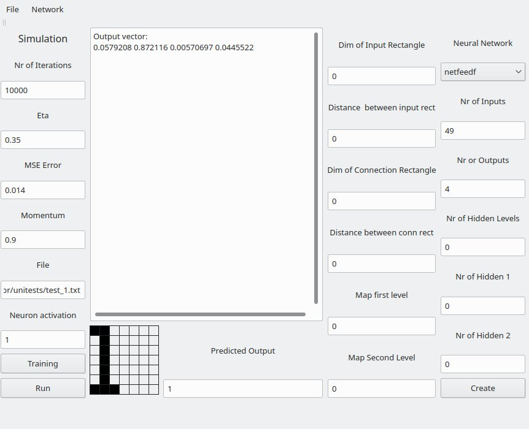

# Artificial Intelligence Projects

## corenlp_examples

This is based on https://stanfordnlp.github.io/CoreNLP/additional.html

And is inspired from:

https://blogs.oracle.com/javamagazine/post/java-natural-language-intent-recognition

https://blogs.oracle.com/javamagazine/post/java-sentiment-analysis-stanford-corenlp

https://blogs.oracle.com/javamagazine/post/java-sentiment-analysis-domain-specific-phrases

# Neural network simulator

This is a rewrite (with UI) of :

Retele neuronale artficiale by Gavril Toderean, Mircea Costeiu, Mircea Giurgiu Editura Albastra, Cluj-Napoca 1995

